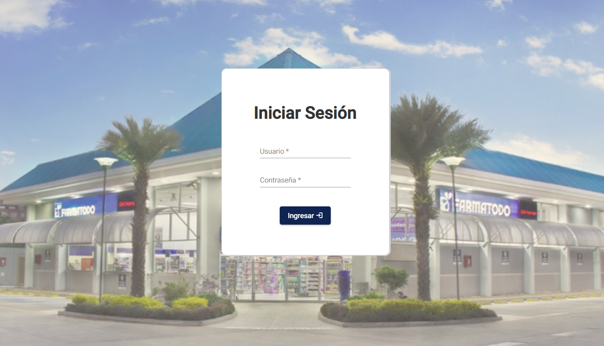
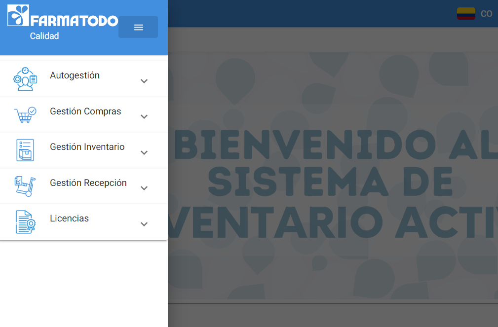

# Farmatodo - Sistema de Inventario Activo

Implementación Sistema de Inventario Activo 📈 - Multipaís Venezuela | Colombia 📋

 

 

## Descripción (Description) 📋

Después haber realizado una exploración del código fuente legado basado en el esqueleto de Frontend de Angular v13, donde se identificó que la codificación legada aun cuando respetaba la mayoría de los estándares establecidos por el equipo de trabajo del [PAC v2.0](https://github.com/achique-luisdan/farmatodo-portal-aplicaciones-corporativas), no obstante el nivel de acoplamiento de los componentes era muy alto, tanto que al realizar el cambio más mínimo se rompían muchos componentes.

En este orden de ideas, al tener una idea general de las dos (2) nuevas funcionalidades a implementar, se realizó en el Sprint Planning la estimación concerniente para ser abordadas durante el ciclo de desarrollo de un (1) sprint de dos (2) semanas, diez (10) días hábiles.

Los componentes de Base de datos (DB) y Backend (API) fueron desarrollados por la profesional Génesis; el componente frontend fue mi responsabilidad:

**Módulo > Menú > Funcionalidad**

**Autogestión > Utilidades > Gestión Utilidades**

**Gestión Licencias > Licencias > Gestión Licencias**

Estas nuevas funcionalidades fueron implementadas con éxito de forma satisfactoria durante el tiempo estimado, además se realizó la migración a la versión v14 de Angular y se activó el switcheo multi-país.

Posteriormente, desde la sinergia y el feedback de los profesionales Carlos, Emmanuel y José Luis se realizaron un conjunto de observaciones sobre la base de datos que desencadenaron en cambios varios en todas las capas (DB, API y Frontend).

En este sentido, progresivamente se aplicaron con éxito los cambios para ambos países (VE, CO) en todos los módulos, menús y funcionalidades.

## Características(Features) ❤️

Inicio de Sesión (Login)

Home con Sidebar

Dialogs y SnackBar

Loader animación de carga HTTP

**Módulos**

*Nuevos*
- Autogestión (Gestión de Utilidades)

- Licencias (Gestión de Licencias)

*Existentes*

- Compras

- Inventario

- Recepción

## Herramientas (Tools) 🛠️

Las herramientas utilizadas en el desarrollo del proyecto fueron:

* [Node JS v14 o superior](https://nodejs.org/es/) - Entorno de Ejecución de Servidor para JavaScript

* [Angular v14](https://angular.io/) - Framework Web Frontend para crear SPA (Single Page Aplication).
 
* [Angular Material v14](https://material.angular.io/) - Framework CSS basado en Material Desing para el diseño de interfaz web modernas.

* [NgRx](https://ngrx.io/) - Gestión del Estado Global de Aplicaciones Angular

## Equipo (Team) ✒️

A continuación se menciona a todos aquellos que participaron:

* **Genesis Martinez** - *Desarrolladora Web Backend*
  
* **Luis Achique** - *Desarrollador Web Frontend* - [GitHub: @achique-luisdan](https://github.com/achique-luisdan)

## Reseñas (Reviews) 💞

